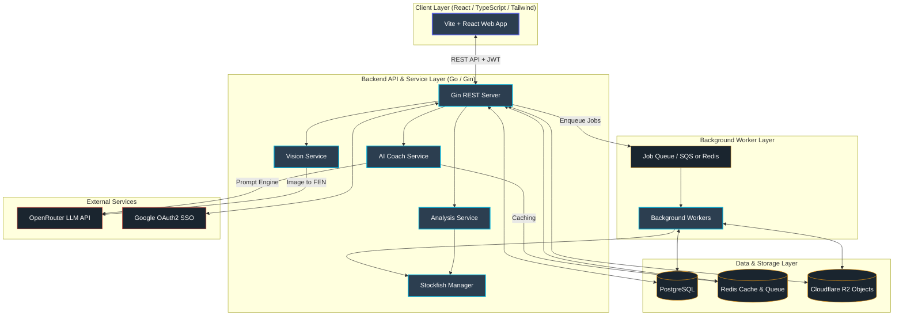

# 🧠 ChessLens (ChessGoddess)

[](https://golang.org)
[](https://vitejs.dev)
[](https://tailwindcss.com)
[](https://aws.amazon.com)
[](https://cloudflare.com)

> **ChessLens** (codenamed *ChessGoddess*) is a cinematic chess analysis studio that turns raw engine output into readable insight, visual tension, and beautiful review experiences. It allows players to truly *see* thinking.

Instead of displaying standard, confusing engine graphs and rigid arrows, ChessLens crafts a cohesive narrative for every game: explaining positional nuances, highlighting tactical turning points with rich visual polish, and generating immutable shareable review snapshots.

---

## 🗺️ System Architecture



Detailed architectural information, network isolation details, and production specs are available in the [Architecture Documentation](docs/ARCHITECTURE.md).

---

## 🔥 Key Features

### 1. 🎨 Cinematic Review Experience
* **Dark Chess Hall Aesthetic:** Deep charcoal tones, walnut wood texture overlays, subtle vignette lighting, and soft gold accents.
* **Spring-Physics Eval Bar:** Evaluation swings are rendered using spring-based physics, decaying smoothly and shifting dramatically during blunders.
* **Fluid Move Transitions:** Pieces glide seamlessly across the board; blunders trigger a highly-refined micro-shake animation.

### 2. 🧠 AI Coach & Positional Narratives
* **Contextual Explanations:** Deep integration with **OpenRouter LLMs** to explain "why this move is bad," positional trade-offs, and critical mistakes in plain English.
* **High-Efficiency Redis Caching:** Every unique chess position's explanation is cached, minimizing API latency and keeping OpenRouter token costs near zero.

### 3. 📸 Frozen Review Snapshots
* **Immutable Artifacts:** Unlike mutable dashboards, finished analysis sessions are frozen into public-facing immutable JSON snapshots (`/s/:snapshot_id`).
* **Zero-Drift Sharing:** Share links display the exact engine assessments, evaluations, and AI notes forever—completely isolated from future engine drift or recomputation.

### 4. 👁️ Vision Engine (Image-to-FEN)
* **Automatic Layout Recognition:** Drag-and-drop screenshots or paste board images directly. Our vision model parses the board layout, translates it into FEN, and initializes a live analysis session.

### 5. ⚡ Highly Scalable Job Pipeline
* **Decoupled Workers:** Stockfish evaluations run asynchronously inside non-blocking background workers.
* **Dual-Provider Queue:** Leverages raw Redis (`LPUSH`/`BRPOP`) locally for ultra-fast dev cycles, and scales to AWS SQS with long-polling in production.

---

## 🛠️ Tech Stack

### Frontend
* **Core:** React 18, TypeScript, Vite
* **Styling & Motion:** Tailwind CSS, Framer Motion
* **State Management:** Zustand
* **Routing:** React Router v6

### Backend
* **Core & Routing:** Go 1.22+, Gin Web Framework
* **Engine parsing:** `github.com/notnil/chess` (PGN parsing and FEN state generation)
* **Structured Logging:** Go `log/slog` (Structured JSON output in production)

### Infrastructure & Services
* **Primary DB:** PostgreSQL (Pgxpool connection pool)
* **Cache & Local Queue:** Redis
* **Production Queue:** AWS SQS (with Dead Letter Queues for resilience)
* **Object Store:** Cloudflare R2 (S3-compatible, for snapshot screenshots and avatars)
* **Authentication:** Google OAuth 2.0 with JWT (stored in HttpOnly, secure cookies)
* **AI & Vision:** OpenRouter API (Claude 3.5 Sonnet / GPT-4o-mini / Vision models)

---

## 📂 Repository Structure

```txt
├── cmd/
│   └── server/               # Application entry point (main.go)
├── internal/
│   ├── api/                  # Gin routers, middleware stack, HTTP handlers
│   ├── auth/                 # Google OAuth2 & JWT session management
│   ├── config/               # Schema-validated environment config loaders
│   ├── db/                   # PostgreSQL connection pool setup
│   ├── engine/               # Stockfish process manager (stdin/stdout over UCI)
│   ├── game/                 # Game and PGN processing logic
│   ├── middleware/           # Rate limiting, recovery, logger, JWT validation
│   ├── model/                # Domain entities & database schemas
│   ├── repository/           # PostgreSQL data-access layers
│   ├── service/              # Business logic (Stockfish analysis, AI explanations, Vision)
│   ├── storage/              # Cloudflare R2 object storage client
│   └── worker/               # Background task workers (Redis & SQS queues)
├── frontend/                 # Vite-based React single-page application
├── migrations/               # Raw SQL database migrations
├── docker/                   # Deployment-specific Dockerfiles
├── terraform/                # Infrastructure-as-code for AWS production deployment
├── docs/                     # Full ARCHITECTURE.md and API.md guides
├── Makefile                  # Local orchestration scripts
└── docker-compose.yml        # Multi-service local dev composition
```

---

## ⚡ Getting Started

### Prerequisites
* [Go 1.22+](https://go.dev/dl/)
* [Node.js 18+](https://nodejs.org/)
* [Docker & Docker Compose](https://www.docker.com/products/docker-desktop/)
* [Stockfish Binary](https://stockfishchess.org/download/) installed locally or accessible via PATH.

### 1. Clone & Set Up Environments
Clone the repository:
```bash
git clone https://github.com/shihabshahrier/ChessGoddess.git
cd ChessGoddess
```

Create local environment files for the backend and frontend. We provide an `.env.example` in the root:
```bash
cp .env.example .env
```
Update the `.env` variables (e.g., your `OPENROUTER_API_KEY`, Google OAuth Credentials, and Stockfish executable path).

### 2. Launch Supporting Services
Spin up PostgreSQL and Redis in the background using Docker Compose:
```bash
make up
```

### 3. Run Database Migrations
Apply the initial schema migrations to your local PostgreSQL instance:
```bash
make migrate
```

### 4. Run the Backend API
Start the Gin server:
```bash
make dev
```
The backend server runs by default on [http://localhost:8080](http://localhost:8080). You can check health status via `/health`.

### 5. Run the Frontend App
Open a new terminal window, navigate to the frontend folder, install dependencies, and spin up the Vite development server:
```bash
cd frontend
npm install
npm run dev
```
The frontend application will be served at [http://localhost:3000](http://localhost:3000).

---

## 📦 Makefile Reference

A comprehensive set of commands is defined in the `Makefile` to simplify development tasks:

| Command | Action |
|---------|--------|
| `make up` | Starts Postgres & Redis containers in detached mode |
| `make down` | Shuts down local Docker Compose containers |
| `make migrate` | Applies all raw SQL migrations inside `migrations/` to the database |
| `make dev` | Launches the Go backend REST API in development mode |
| `make frontend` | Starts the Vite + React dev server |
| `make frontend-build` | Compiles the frontend for production distribution |
| `make test` | Executes all Go tests with the `-race` detector and prints coverage |
| `make build` | Builds the optimized production Go binary inside `bin/` |
| `make fmt` | Formats all Go source files according to `gofmt` style |
| `make clean` | Wipes compiled binaries and local coverage reports |

---

## 🧬 Data Model

The application leverages PostgreSQL as the source of truth, managing relations through clear foreign-key structures:

```
users (Google ID, SSO Identity)
  ├── games (PGN/FEN source data & time controls)
  │   └── analysis_sessions (Immutable review containers)
  │       ├── moves (Engine evaluations, SAN, move-quality classifications)
  │       │   └── ai_explanations (Cached OpenRouter explanations)
  │       └── snapshots (Frozen JSON review artifacts)
  └── uploads (Uploaded board images & Cloudflare R2 receipts)
```

---

## 🔐 Security & Operations

* **HttpOnly Session Cookies:** User JWTs are transmitted exclusively in `HttpOnly`, `Secure`, and `SameSite=Lax` cookies, neutralizing XSS session leakage.
* **Token-Bucket Rate Limiting:** All API gateways restrict abusive traffic down to `10 req/s` per IP, with a burst threshold of `30`.
* **Upload Sanitation & Guardrails:** Large payloads are intercepted at the gateway level (`MaxBytesReader`) restricting PGN text files to `1MB` and images to `10MB`.
* **State Verification (CSRF):** OAuth callbacks authenticate state tokens strictly to prevent request forgery.

---

## 🚀 AWS Production Deployment

The production environment is fully automated using **Terraform** inside `terraform/`. It is optimized for durability, high-availability, and low operating costs (~$90/month):

* **Elastic Container Service (ECS):** Runs the Gin API on low-cost **Fargate On-Demand** tasks, and schedules background queue workers on **Fargate Spot** (saving up to 70% in compute overhead).
* **Aurora Serverless v2:** Dynamically scales Postgres capacity between `0.5` to `16` ACUs in response to load.
* **SQS Integration:** Workers long-poll (`20s`) dedicated FIFO/Standard queues for high throughput, routing failed processes to Dead Letter Queues (DLQs).
* **Cloudflare Pages & R2:** Serving lightning-fast static assets globally, and writing board previews directly into R2 object buckets.

---

## 📄 Documentation

* [API Endpoint Reference](docs/API.md) — Comprehensive guide on public/protected HTTP endpoints, request bodies, and error formats.
* [System Architecture & Deployment Guide](docs/ARCHITECTURE.md) — Deep dive into components, workers, queues, security, database schemas, and AWS Terraform deployments.

---

## 🛡️ License

This project is licensed under the MIT License. See [LICENSE](LICENSE) for details.
